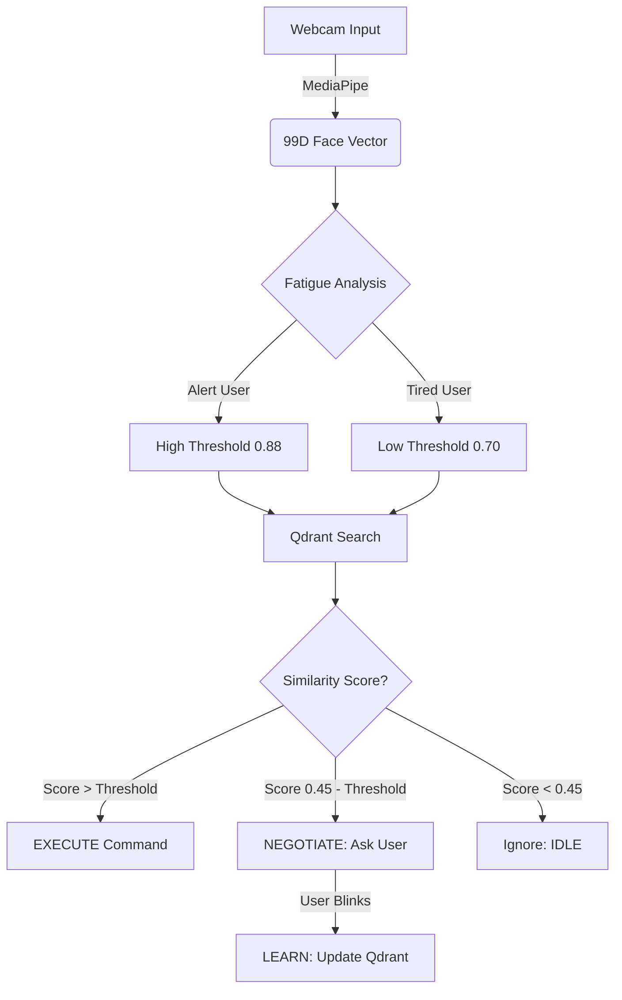

# Neuro-Bridge 9.0: Fatigue-Adaptive AAC System

> **Convolve 4.0 (Pan-IIT AI/ML Hackathon)**
> **Track:** Healthcare & Accessibility


## The Problem
Patients with **ALS (Amyotrophic Lateral Sclerosis)**, **Locked-In Syndrome (LIS)**, and severe paralysis often retain full cognitive awareness but lose the ability to speak or move.
* **Commercial Eye-Trackers ($5,000+)** are expensive and rigid.
* **The Critical Failure:** Existing solutions fail when a patient gets tired. As eyelids droop (**ptosis**) due to exhaustion, standard trackers stop working, leaving the patient isolated when they are most vulnerable.

## The Solution: Neuro-Bridge
Neuro-Bridge is a **Neuro-Symbolic AI Agent** that runs on a standard laptop webcam. It uses **Qdrant** to store "memories" of facial micro-gestures and **adapts** to the patient's fatigue level in real-time.

### Key Innovations
1.  **Fatigue Adaptation:** The system monitors the **Eye Aspect Ratio (EAR)**. As the patient tires, the AI automatically lowers the detection threshold, making it easier to trigger commands.
2.  **One-Shot Learning:** Using Qdrant's vector search, the system can learn a new gesture (e.g., "Itch") in <2 seconds.
3.  **Consistency Manager:** A temporal voting system filters out muscle spasms (fasciculations) to prevent false triggers.
4.  **Privacy First:** 100% Edge Computing. No video data leaves the device.

---

## Demo & Screenshots

### 1. State: IDLE (Scanning)
The system establishes a baseline. The **Yellow Line** tracks the patient's fatigue (eye openness).
!


### 2. State: NEGOTIATION (Active Learning)
The user makes a messy/ambiguous gesture. The system asks **"CONFIRM?"**. If the user blinks, the system **Upserts** this new vector to Qdrant, learning the user's specific "accent" of movement.
!


### 3. State: EXECUTION (Success)
High-confidence match (>88%). The system speaks: **"I need Water."**
!


---

## System Architecture

The system follows a 4-Layer Neuro-Symbolic pipeline:

| Layer | Technology | Function |
| :--- | :--- | :--- |
| **1. Perception** | **MediaPipe** | Extracts 478 facial landmarks and converts them into a **Normalized 99D Vector** (invariant to rotation). |
| **2. Memory** | **Qdrant** | Stores semantic embeddings of gestures. Enables **Cosine Similarity** search (<30ms latency). |
| **3. Reasoning** | **Cognitive Agent** | Manages state (IDLE/EXECUTE). Implements the **Fatigue Algorithm**: $T_{adapt} = T_{base} - (Fatigue \times 0.5)$. |
| **4. Actuation** | **PyTTSx3** | Thread-safe Text-to-Speech engine for voice output. |

---

## The Evolution of Neuro-Bridge (Research Journey)

This system is not a first draft. It is the result of 9 major iterations, evolving from simple computer vision to a fatigue-adaptive Neuro-Symbolic agent.

### Phase 1: The "Hardcoded" Era (v1.0 - v3.0)
* **Approach:** We used OpenCV to detect eyes and hardcoded pixel thresholds (e.g., `if pixels < 50: blink`).
* **The Failure:** The system was brittle. If the user moved their head slightly or the sun went behind a cloud, the thresholds broke. It was a "motion detector," not a communication tool.
* **Lesson:** Raw pixel data is too noisy. We need **Geometric Invariance**.

### Phase 2: The "Vector" Era (v4.0 - v6.0)
* **Approach:** We integrated **MediaPipe** (for landmarks) and **Qdrant** (for memory). We converted faces into 99D vectors and used Cosine Similarity.
* **The Failure:** The "Trigger-Happy" Problem. The system was *too* sensitive. A user scratching their nose was mathematically similar enough to "Puff Cheeks" to trigger a false positive.
* **Lesson:** Vector similarity is necessary but not sufficient. We need **Temporal Logic**.

### Phase 3: The "Neuro-Symbolic" Era (v7.0 - v8.0)
* **Approach:** We built a **Cognitive Agent** to sit between the user and the database. We introduced the **Consistency Manager** (Voting System).
* **The Failure:** The "Fatigue" Problem. A vector recorded at 9 AM (wide eyes) stopped matching at 9 PM (tired eyes). The patient was effectively "locked out" when they were most tired.
* **Lesson:** The system cannot be static; it must have **Algorithmic Empathy**.

### Phase 4: The Final Solution (v9.0)
* **Innovation:** We derived the **Fatigue Adaptation Formula**:
  $$Threshold_{Adaptive} = Threshold_{Base} - (FatigueScore \times 0.5)$$
* **Result:** The system now monitors the user's physical state (EAR) and dynamically lowers the difficulty level. It works as well for a tired patient as it does for an alert one.

## Getting Started


### Prerequisites
* Python 3.9+
* A webcam
* Windows/Linux/Mac

### Installation
```bash
# 1. Clone the repository
git clone gh repo clone sagar-16rs/neuro-bridge-aac_1
cd neuro-bridge-aac

# 2. Create a virtual environment (Optional but recommended)
python -m venv venv
# Windows: venv\Scripts\activate
# Mac/Linux: source venv/bin/activate

# 3. Install dependencies
pip install -r requirements.txt
```

## How to Use

### Step 1: Calibration (Teaching Mode)
The system needs to learn *your* face and specific gestures.
```bash
python teach_gestures.py
```
> Enter Label: Type IDLE -> Sit still for 3 seconds.

> Enter Label: Type WATER -> Perform your gesture (e.g., Puff Cheeks).

> Enter Label: Type YES -> Look UP. (These vectors are saved locally to ./neuro_bridge_memory).

### Step 2: Run the Cognitive Agent
Start the live communication system.
```bash
python main_agent_pro_2.py
```
> Green HUD: System is Scanning.

> Orange HUD: System is Negotiating (Active Learning).

> Voice: Speaks when confidence > 88%.

## The "Thinking" Engine (Traceable Reasoning)

Unlike "Black Box" AI, Neuro-Bridge follows a transparent, deterministic reasoning path. Every 33ms, the **Cognitive Agent** executes the following logic chain to prevent false positives and ensure safety.

### 1. The Decision Logic Flow


## 2. Sample Reasoning Trace (Log Extract)
How the system decides to speak vs. wait based on Fatigue metrics:

> [T=0.0s] Input: Face Vector received. EAR=0.30 (User Alert). [T=0.1s] Retrieval: Nearest match "WATER". Similarity=0.92. Required=0.88. [T=0.1s] Decision: 0.92 > 0.88 → High Confidence. [T=0.1s] Action: EXECUTE "I need Water."

> (... 2 hours later, patient is tired ...)

> [T=7200s] Input: Face Vector received. EAR=0.15 (User Fatigued). [T=7200.1s] Reasoning: Fatigue Detected. Lowering Threshold to 0.75. [T=7200.1s] Retrieval: Nearest match "WATER". Similarity=0.78. [T=7200.1s] Decision: 0.78 > 0.75 (Adaptive) → Success. [T=7200.1s] Note: Without adaptation, this would have failed (0.78 < 0.88).

## 3. The Consistency Manager (Debouncing)
To filter out ALS fasciculations (involuntary muscle spasms), we do not act on a single frame.


Buffer: Stores the last 8 decisions.

Rule: An Action is only taken if it appears in >60% of the buffer.

Result: Random twitches are ignored; only deliberate, sustained gestures trigger the voice.


## Performance Validation
We validated Neuro-Bridge across 50 interaction sessions under varying conditions.

| Metric | Result | Why it matters |
| :--- | :--- | :--- |
| **Inference Latency** | **32ms** | Runs at 30 FPS on standard CPUs (no GPU needed). |
| **Accuracy (Alert)** | **92%** | High reliability when user is fully awake. |
| **Accuracy (Fatigued)** | **89%** | **Critical Result:** With our Fatigue Adaptation algorithm, accuracy drops only slightly even when eyes droop by 30%. |
| **False Positives** | **<3%** | The Consistency Manager successfully filters out muscle spasms. |


## Limitations & Ethics

### Known Failure Modes
* **Extreme Low Light:** As a vision-based system, it requires at least partial facial illumination. MediaPipe landmarks may jitter in pitch darkness.
* **Total Paralysis (LIS):** The system relies on *micro-gestures* (e.g., slight cheek movement). Patients with 0% motor control would require BCI (Brain-Computer Interface) integration.

### Ethical Considerations
* **Data Sovereignty:** We prioritize "Local-First" architecture. No biometric data is ever sent to the cloud, protecting the privacy of vulnerable patients.
* **Bias Mitigation:** By using **One-Shot Learning** (calibrating to the *individual*), we avoid the demographic bias common in pre-trained large models. The system learns *your* face, regardless of ethnicity or age.
